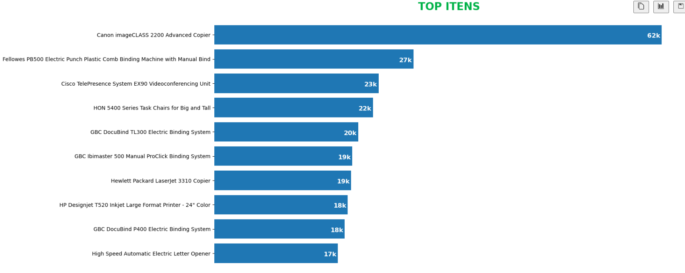

# Criando uma Apresentação Executiva

## Descrição do Projeto

Este projeto utiliza a base de dados de vendas do Kaggle, disponível em [Sales Forecasting Dataset](https://www.kaggle.com/datasets/rohitsahoo/sales-forecasting), para analisar o desempenho das vendas em um determinado período. O objetivo é responder a três perguntas principais:

1. Como foram as **vendas** nesse período?
2. Qual foi a **categoria mais vendida**?
3. Qual foi o **item mais vendido**?

## Descrição dos Dados

Os dados utilizados incluem as seguintes colunas:

- **Order ID**: Identificação do pedido.
- **Order Date**: Data do pedido.
- **Ship Date**: Data de envio.
- **Ship Mode**: Modalidade de envio.
- **Customer ID**: Identificação do cliente.
- **Customer Name**: Nome do cliente.
- **Segment**: Segmento de mercado do cliente.
- **Country**: País do cliente.
- **City**: Cidade do cliente.
- **State**: Estado do cliente.
- **Postal Code**: Código postal do cliente.
- **Region**: Região do cliente.
- **Product ID**: Identificação do produto.
- **Category**: Categoria do produto.
- **Sub-Category**: Subcategoria do produto.
- **Product Name**: Nome do produto.
- **Sales**: Valor das vendas.

## Ferramentas Utilizadas

Neste projeto, utilizei o **matplotlib** para criar gráficos que ilustram os resultados das análises. Também foi necessário realizar o tratamento dos dados para garantir sua integridade e utilizabilidade.

## Conclusões

1. **Como foram as vendas nesse período?**
    - A análise mostrou as tendências de vendas ao longo do tempo, identificando períodos de alta e baixa.
    
        

2. **Qual foi a categoria mais vendida?**
    - Determinei qual categoria de produtos teve o maior volume de vendas, destacando-se em relação às outras.
        

3. **Qual foi o item mais vendido?**
    - Identifiquei o produto específico que alcançou o maior número de vendas, proporcionando insights valiosos sobre a preferência dos clientes.
        
    

**Lembrete**: O código foi realizado na versão 3.11.7 do python
